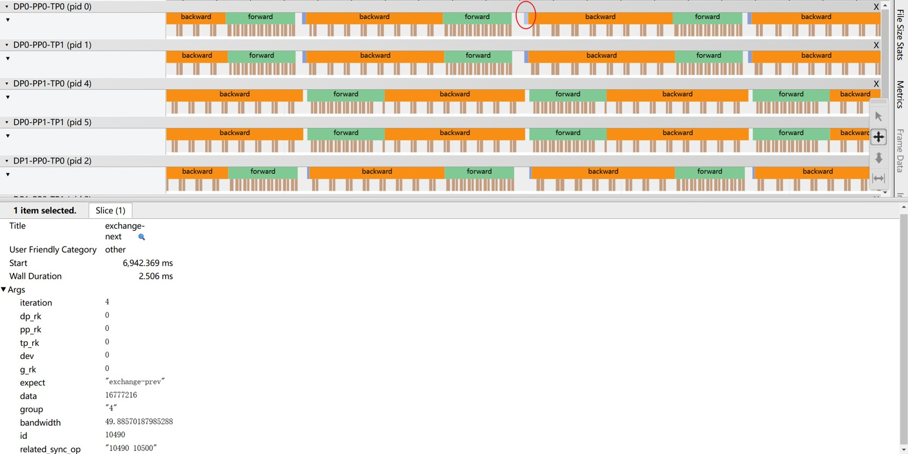
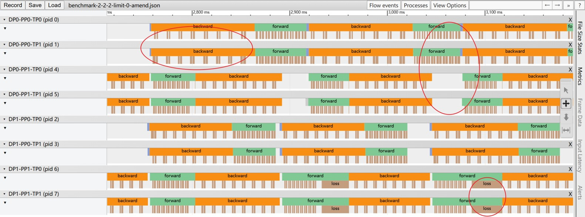

> Note: 从 Profiling with the Tracers 开始是原先打点的工作，我们在原先打点工作的基础上开展了异常检测和定位的工作。

请先按照从 Profiling with the Tracers 的步骤收集负载追踪数据。原先收集的打点信息只包含操作的时序信息，但对训练的语义是没有感知的。我们需要进行依赖关系重建，将打点信息与训练的语义关联起来，具体而言，我们要识别哪些事件构成同一次通信操作，这为异常检测和定位提供了基础。

# 依赖关系重建

使用 torch.distributed.get_process_group_ranks(group) 函数记录下通信 Peer
线性扫描一次所有事件，扫描过程中将未集齐所有参与者的通信操作放入一个 map 进行维护，集齐后剔除该通信操作，见 benchmark/script/dependency.py

我们将通信操作的Peer记录在related_sync_op字段中，expect 字段是通信操作对端的操作，allreduce就是allreduce，而send就是recv，以此类推



# 时间轴对齐

不同rank的时间戳基于自身GPU的时钟，可能有误差。注意到，一次同步通信操作的所有参与者在逻辑上必须同时完成，我们选择一个基准 Rank（如 Rank 0），利用前一步骤得到的同步通信关系的结束时刻作为“校准点”，迭代式地逐步将其余 Rank 的时间轴向基准对齐。

不过训练迭代的时间一般不长，误差不会累计太大，这个对齐操作是可选的。

# 异常检测

核心思想：真正的故障源在其参与的所有相关同步通信组中都表现为最慢的成员。推理如下

不同 DP 组执行的计算操作是相同的，如果某个 Rank 的一个操作显著慢于其他 DP 组内对应 Peer 的对应操作，那么它是一个潜在“慢节点”

然而，这样的“慢节点”可能会有很多：
- 自身变慢
- 被其他节点“拖慢”



上图是 rank0 (第一行) 对应的 GPU 被降频的表现。

我们只需要找到在所有通信组里都是最慢的那个 Rank，即选取 DP 慢节点候选者和 TP 慢节点候选者的交集
- TP 慢节点：慢于集合通信 Peer
- DP 慢节点：慢于其他 DP 组内执行相同操作的 Peer

见 benchmark/script/aggregate.py 的 try_detect 函数，加入 -d/--detect 参数即可启用异常检测。

对于 PP 慢节点，我们可以考察流水线预热阶段 P2P 通信的有效带宽，这个带宽可以使用 Perfetto SQL 查询得到，在 benchmark/script/detect.py 有一个简单的例子。

# 实验测试

benchmark/experiment.py 和 benchmark/experiment.sh 是使用随机注入异常的方式来测试异常检测和定位的实验脚本。

GPU 降频我们通过 `nvidia-smi -lgc` 命令来模拟，PCIe 降级我们通过 benchmark/pcie_set_speed.sh 脚本来模拟，将 PCIe 链路降级到 PCIe 2.0。

benchmark/experiment.py 每次会随机选一个 rank，在这个 rank 上随机选一个 GPU 注入一种异常，将注入的异常信息记录在 `benchmark/experiment_log.txt` 中，形如：
```
Round 1:
Throttled rank: 1
Node: n09
Throttled GPU: 1
```

异常检测脚本 `benchmark/script/aggregate.py` 会把检测出的慢节点信息记录在 `benchmark/abnormal.txt` 中，实验脚本会比对 `benchmark/experiment_log.txt` 和 `benchmark/abnormal.txt`，如果检测出的慢节点和注入的异常一致，则认为检测成功，最后汇报多轮的检测成功率。

======================================================

# Profiling with the Tracers

本 fork 针对 Megatron-LM 设计了一个打点框架，支持基于事件的记录，支持异步 CUDA 事件，并且可以输出至 Chrome tracing 格式文件以便可视化。

## How-to

配置方法和仓库根目录的 README-TCal 的描述相同。

```bash
# working directiory: benchmark
# cd benchmark
python -m pip install tensorstore zarr
bash script/benchmark.sh install v4
bash script/benchmark.sh setup v4
OMP_NUM_THREADS=16 bash script/benchmark.sh train
```

从这里就开始不同了。我们的 log 格式和之前完全不同。当 `bash script/benchmark.sh train` 执行完毕后，你可以在 `benchmark/Megatron` 目录下找到许多文件名格式为 `benchmark-data-${data_parallel_rank}-pipeline-${pipeline_model_parallel_rank}-tensor-${tensor_model_parallel_rank}.json` 的文件，它们是每个 rank 的打点文件。我们必须要将它们聚合为一个统一的 log 文件。

```bash
# working directiory: benchmark
python script/aggregate.py
```

上述脚本会在当前目录生成一个 `benchmark.json` 文件。这个文件可以被 Chrome 浏览器的 `chrome://tracing` 页面加载。点击 `Load` 按钮，选择这个文件，就可以看到一个时间轴了。

## Usage

### Scopes

在你需要打点的文件里，使用 `from megatron.core.trace import tracers` 导入 `tracers`，即可使用以下的简单 API：

```python
with tracers.scope('my_event'):
    # code block
    # the duration will be timed
```

来插入桩位。这个 API 会自动记录进入和退出事件，以及代码块的执行时间。在 `chrome://tracing` 页面中，你会看到一段名为 `my_event` 的 `duration` 事件，它的持续时间就是代码块的执行时间，并且你也可以轻松看到其开始和结束时间。

你也可以使用 `tracers.tick('my_event')` 来记录一个单次事件。

### Recording Extra Information

有的时候你需要在事件中附加一些额外的信息，比如当前的 microbatch index。这时，你可以给 `scope` 传递一些额外的 `kwargs`：

```python
with tracers.scope('my_event', key=value):
    # code block
```

那么 `"key": value` 就会被记录在 `my_event` 中。在 `chrome://tracing` 页面里，点击 `my_event` 事件，你会看到一个 `args` 字段，里面就是你记录的额外信息。

### Passing around Parameters

`scope` 同时也是一个上下文管理器。你可以通过 `scope` 来传递参数给子 `scope`，也可以从子 `scope` 中获取参数。当一段你需要打点的逻辑被封装得太深，你不便于直接传递参数的时候，就可以透过 `scope` 来传递。

以下是向下传递参数的例子：

```python
# you need to pass a parameter down to a descendant scope

def my_function():
    # we enter a descendant scope
    with tracers.scope('my_event'):
        # you can access the parameter here
        param = tracers.get('param')

with tracers.scope(None, ctx={'param': value}): # when a scope is not named, it is not timed
    my_function() # the parameter is passed down
```

以下是向上传递参数的例子（当你需要记录一些信息但是你无法在顶层 `scope` 知道，那么你可以让深层 `scope` 去设置这个信息）：

```python
# you need to pass a parameter up to an ancestor scope

def my_function():
    # we need to pass the parameter up
    tracers.set('param', value)

with tracers.scope('my_event', param=None):
    my_function() # the parameter is passed up, and finally recorded in the event
```

结合起来，你可以这么实现一个 callback 机制：

```python
def my_function():
    if tracers.get('critical_information'):
        tracers.set('critical_information', 42)

with tracers.scope('my_event', ctx={'critical_information': True}, critical_information=None):
    my_function()
```

事实上，以上可以被简写为 `tracers.scope('my_event', slots=['critical_information'])`。

## Source Walkthrough

打点的核心逻辑都位于 `benchmark/script/megatron4.0/trace.py` 中。代码中有详细的注释，你可以阅读这个文件来了解打点的实现细节。以下是一些具体的细节。

### CUDA Events

为了保证性能，所有打点均使用 CUDA 事件以避免同步开销。你应该避免使用 `torch.cuda.synchronize()`。同时，应该避免在打点代码中使用 `time.time()` 这样的函数调用，因为这无法与异步事件同步。

### Timeline Alignment

我们把所有 `rank` 的打点文件聚合在一起之后，该如何对齐时间轴呢？事实上，这有根本性的难度。假设我们需要一个同步的绝对时间，那么首先，我们即使可以用 NTP 之类的协议让每个 rank 的 Host 时间同步，但是由于我们在记录 GPU 上的事件，我们必须要让 Host 和 Device 时间同步才行，但是这是不可能的，因为 `torch.cuda.synchronize()` 并没有延迟上的保证，只有事件同步的语义。

所以，目前时间轴的对齐是比较简陋的，我们只是在每个 iteration 开始的时候放置一个 `barrier`，并且以此对齐 iteration 内的所有时间戳。参见 `benchmark/script/aggregate.py`。更好的方法可能是对齐 pipeline 之间交换张量结束时的时间。
